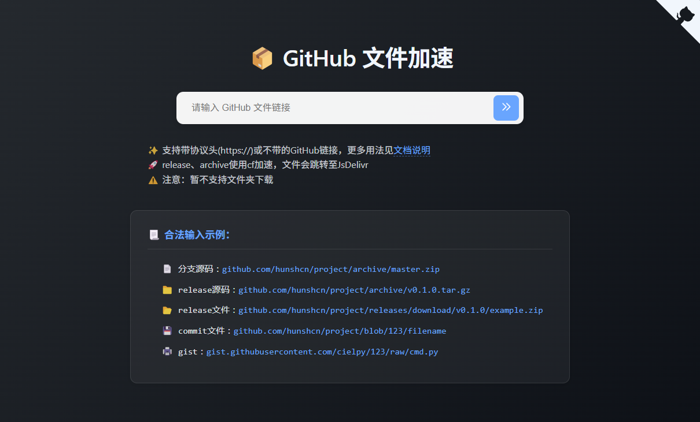
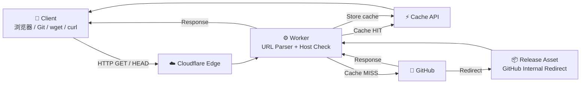

<div align="center">

# 📦 CF-Workers-GitHub

### GitHub Proxy & Acceleration on Cloudflare Workers

**GitHub 资源代理 · Release 加速 · Archive · Raw · Gist · Git Clone**

[](https://github.com/zb479519891/CF-Workers-GitHub/stargazers)
[](https://github.com/zb479519891/CF-Workers-GitHub/network/members)
[](./LICENSE)
[](https://workers.cloudflare.com/)
[](https://github.com/zb479519891/CF-Workers-GitHub/commits/main)

<br>

[](https://deploy.workers.cloudflare.com/?url=https://github.com/zb479519891/CF-Workers-GitHub)

<br>

**中文** · [English](#-english)

</div>

---

<div align="center">



</div>

## 🇨🇳 中文

> 一个轻量、可自部署的 GitHub 资源代理工具，运行于 **Cloudflare Workers / Pages**。

CF-Workers-GitHub 将 GitHub 请求交由 Cloudflare 全球网络转发，无需自建服务器，即可搭建属于自己的 GitHub 文件与 Release 代理。

### 🌐 在线 Demo

> **目前未提供公共 Demo。**  
> 推荐直接点击上方 **Deploy to Cloudflare** 按钮，一键部署到你自己的 Cloudflare 账号。
>
> 公共代理容易受到流量、频率和平台策略影响；长期使用建议绑定自己的域名。

**项目主页：** https://github.com/zb479519891/CF-Workers-GitHub

---

## ✨ 功能特性

| 功能 | 说明 |
|:---|:---|
| 📦 Release | GitHub Release 文件代理与下载 |
| 🗂️ Archive | 分支 / Tag 源码 ZIP、TAR.GZ |
| 📄 Blob | GitHub Blob 自动转换为 Raw |
| 🧾 Raw | `raw.githubusercontent.com` 文件代理 |
| 📝 Gist | GitHub Gist Raw 文件代理 |
| 🔁 Redirect | 自动跟随 GitHub Release 内部重定向 |
| ⚡ Cache | Cloudflare Cache API 缓存，默认 1 小时 |
| 🧠 ETag | 支持 ETag / Last-Modified 缓存校验 |
| 📥 Range | 保留下载相关 Range 能力 |
| 🔒 Host 白名单 | 防止 Worker 被用作任意 URL 代理 |
| 🛡️ Method Guard | 仅允许 GET / HEAD / OPTIONS |
| 🌐 CORS | 支持自定义 `Access-Control-Allow-Origin` |
| 🚫 UA 黑名单 | 支持配置 User-Agent 黑名单 |
| 🚀 JSDelivr | 可选 Blob / Raw → JSDelivr |
| 🔧 兼容配置 | 保留 `URL` / `URL302` 配置 |

---

## ⚡ 快速开始

假设你的 Worker 域名：

```
https://github.example.com
```

原始 GitHub URL：

```
https://github.com/OWNER/REPO/releases/download/v1.0.0/example.zip
```

代理后：

```
https://github.example.com/https://github.com/OWNER/REPO/releases/download/v1.0.0/example.zip
```

也支持省略协议：

```
https://github.example.com/github.com/OWNER/REPO/archive/refs/heads/main.zip
```

### 📚 支持示例

**分支源码**

```
https://github.example.com/https://github.com/OWNER/REPO/archive/refs/heads/main.zip
```

**Tag 源码**

```
https://github.example.com/https://github.com/OWNER/REPO/archive/refs/tags/v1.0.0.tar.gz
```

**Release 文件**

```
https://github.example.com/https://github.com/OWNER/REPO/releases/download/v1.0.0/example.zip
```

**Blob 文件**

```
https://github.example.com/https://github.com/OWNER/REPO/blob/main/file.txt
```

**Raw 文件**

```
https://github.example.com/https://raw.githubusercontent.com/OWNER/REPO/main/file.txt
```

**Gist**

```
https://github.example.com/https://gist.githubusercontent.com/USER/GIST_ID/raw/file.txt
```

---

## 🏗️ 架构



### 🔐 请求处理流程

```
Request
   │
   ▼
┌──────────────────┐
│ Parse Target URL │
└────────┬─────────┘
         ▼
┌──────────────────┐
│ GitHub Host Check│─── ❌ ──→ 403
└────────┬─────────┘
         │ ✅
         ▼
┌──────────────────┐
│ Cache Lookup     │
└───────┬──────────┘
    HIT │       MISS
        │          │
        ▼          ▼
     Response   GitHub Fetch
                   │
                   ▼
             Redirect Follow
                   │
                   ▼
             Cache / Response
```

> Mermaid 图在支持 Mermaid 的 GitHub / Markdown 阅读器中会自动渲染。

---

## ☁️ 一键部署

### Deploy to Cloudflare

点击下面按钮，Cloudflare 会引导你将这个公开 GitHub 仓库部署到自己的 Cloudflare Workers。

<div align="center">

[](https://deploy.workers.cloudflare.com/?url=https://github.com/zb479519891/CF-Workers-GitHub)

</div>

> **注意：** Cloudflare 的 Deploy to Cloudflare 按钮面向 **Workers** 应用。本项目的核心入口是 `_worker.js`。

---

## 📄 Cloudflare Pages

如果你更习惯 Pages，可以：

1. Fork 本项目。
2. 在 Cloudflare **Workers & Pages** 中连接 GitHub。
3. 选择本仓库。
4. 构建命令填写：

```bash
echo "No build required"
```

5. 完成部署。
6. 根据需要绑定自己的 Custom Domain。

---

## 👷 Cloudflare Workers

### 方法一：Dashboard

1. 创建 Cloudflare Worker。
2. 打开本项目的 [`_worker.js`](./_worker.js)。
3. 将代码复制到 Worker 编辑器。
4. 保存并部署。
5. 根据需要绑定自己的域名。

### 方法二：Wrangler

如果使用 Wrangler，可以将 `_worker.js` 作为 Worker 入口，并按照你的 Cloudflare 账号、域名和路由配置进行部署。

---

## 🔧 环境变量

| 变量 | 默认值 | 说明 |
|:---|:---:|:---|
| `PREFIX` | `/` | URL 前缀，例如 `/gh/` |
| `CACHE_TTL` | `3600` | Cache API 缓存秒数；`0` 可关闭 Worker Cache |
| `ALLOW_ORIGIN` | `*` | CORS 的 `Access-Control-Allow-Origin` |
| `JSDELIVR` | `false` | 是否启用符合条件的 JSDelivr 跳转 |
| `UA` | 空 | User-Agent 黑名单，支持空格 / 逗号 / 换行分隔 |
| `URL` | 空 | 根路径备用页面；设置为 `nginx` 可返回 Nginx 风格页面 |
| `URL302` | 空 | 根路径 302 跳转地址 |

### 推荐配置

```
CACHE_TTL=3600
ALLOW_ORIGIN=*
JSDELIVR=false
```

如果只给自己的前端站点使用，可以将：

```
ALLOW_ORIGIN=https://example.com
```

设置为实际 Origin。

---

## ⚡ 缓存机制

普通 GET / HEAD 请求会尝试使用 Cloudflare Cache API。

以下情况不会进入 Worker Cache：

- `Authorization`
- `Cookie`
- `Range`
- 源站返回 `private`
- 源站返回 `no-store`
- 源站返回 `Set-Cookie`
- 不适合共享缓存的 `Vary: *`

缓存命中时返回：

```
x-cf-github-cache: HIT
```

项目同时保留 ETag / Last-Modified 等响应头，用于 HTTP 缓存校验。

---

## 🔁 Release 重定向

GitHub Release 文件通常会从 GitHub 跳转到 Release Asset 存储节点。

本项目会继续处理 GitHub 官方允许的内部资产重定向，同时限制重定向次数，避免形成循环。

Release Asset 存储域名不会作为普通用户的任意初始代理目标，从而降低开放代理风险。

---

## 🔐 私有仓库

项目主要面向公开 GitHub 内容。

如果确实需要访问私有仓库，请谨慎处理 GitHub Token，并注意相关请求不会进入 Worker Cache。

例如：

```bash
git clone https://用户名:TOKEN@你的域名/https://github.com/OWNER/PRIVATE-REPO.git
```

### ⚠️ 请勿

- ❌ 将 Token 提交到 GitHub
- ❌ 分享包含 Token 的 URL
- ❌ 将 Token 写入公开脚本
- ❌ 在 Issue / 日志 / 截图中暴露 Token

---

## 🛡️ 安全设计

当前版本默认：

- 🔒 只允许白名单 GitHub Host
- 🚦 仅允许 GET / HEAD / OPTIONS
- ⛔ 其他 HTTP 方法返回 `405`
- 🔁 GitHub 内部重定向最多跟随 5 次
- 🔐 带认证信息的请求不进入 Worker Cache
- 🧊 避免将私有数据写入共享缓存

如果你自行修改 Worker，请谨慎保留 Host 校验和缓存安全策略。

---

## 📁 项目结构

```
CF-Workers-GitHub/
├── _worker.js    # Cloudflare Worker 核心代码
├── README.md     # 项目说明
├── img.png       # Banner / 图片资源
└── LICENSE       # MIT License
```

---

## 🤝 English

### 📦 CF-Workers-GitHub

A lightweight GitHub proxy and acceleration service powered by **Cloudflare Workers / Pages**.

It proxies GitHub files, releases, archives, raw files and Gists through Cloudflare, allowing you to deploy your own GitHub resource proxy without maintaining a server.

### ✨ Features

- GitHub Host allowlist
- Release / Archive / Blob / Raw / Gist support
- GitHub Release redirect handling
- Cloudflare Cache API
- ETag / Last-Modified support
- Range-aware downloads
- GET / HEAD / OPTIONS only
- Blob → Raw conversion
- Optional JSDelivr redirect
- Configurable CORS
- User-Agent blacklist
- `URL` / `URL302` compatibility

### 🚀 Usage

Assume your Worker is:

```
https://github.example.com
```

Proxy a GitHub URL by prefixing it with your Worker URL:

```
https://github.example.com/https://github.com/OWNER/REPO/releases/download/v1.0.0/example.zip
```

You can also omit the target protocol:

```
https://github.example.com/github.com/OWNER/REPO/archive/refs/heads/main.zip
```

### ☁️ Deploy

The easiest way is the **Deploy to Cloudflare** button:

<div align="center">

[](https://deploy.workers.cloudflare.com/?url=https://github.com/zb479519891/CF-Workers-GitHub)

</div>

You can also deploy `_worker.js` manually from the Cloudflare Workers dashboard.

### 🌐 Demo

There is currently **no public demo instance**. Deploy your own Worker for a stable and private endpoint.

### ⚙️ Configuration

| Variable | Default | Description |
|:---|:---:|:---|
| `PREFIX` | `/` | URL prefix, e.g. `/gh/` |
| `CACHE_TTL` | `3600` | Cache lifetime in seconds; `0` disables Worker Cache |
| `ALLOW_ORIGIN` | `*` | CORS allowed origin |
| `JSDELIVR` | `false` | Enable eligible JSDelivr redirects |
| `UA` | empty | Additional User-Agent blacklist |
| `URL` | empty | Root fallback page; `nginx` enables an Nginx-style page |
| `URL302` | empty | Root 302 redirect target |

### 🔐 Private repositories

Private repository access may be used with a GitHub Token, but credentials must be protected and should never be committed or shared publicly.

### 📄 License

MIT License. See [LICENSE](./LICENSE).

---

## 🙏 致谢 / Acknowledgements

Inspired by and based on ideas from:

- [gh-proxy](https://github.com/hunshcn/gh-proxy)
- [jsproxy](https://github.com/EtherDream/jsproxy)

Thanks to all open-source contributors.

---

<div align="center">

### ⭐ 如果这个项目对你有帮助，欢迎 Star

**Deploy it yourself · Run it on your own Cloudflare account · Keep control of your proxy**

[](https://deploy.workers.cloudflare.com/?url=https://github.com/zb479519891/CF-Workers-GitHub)

</div>
